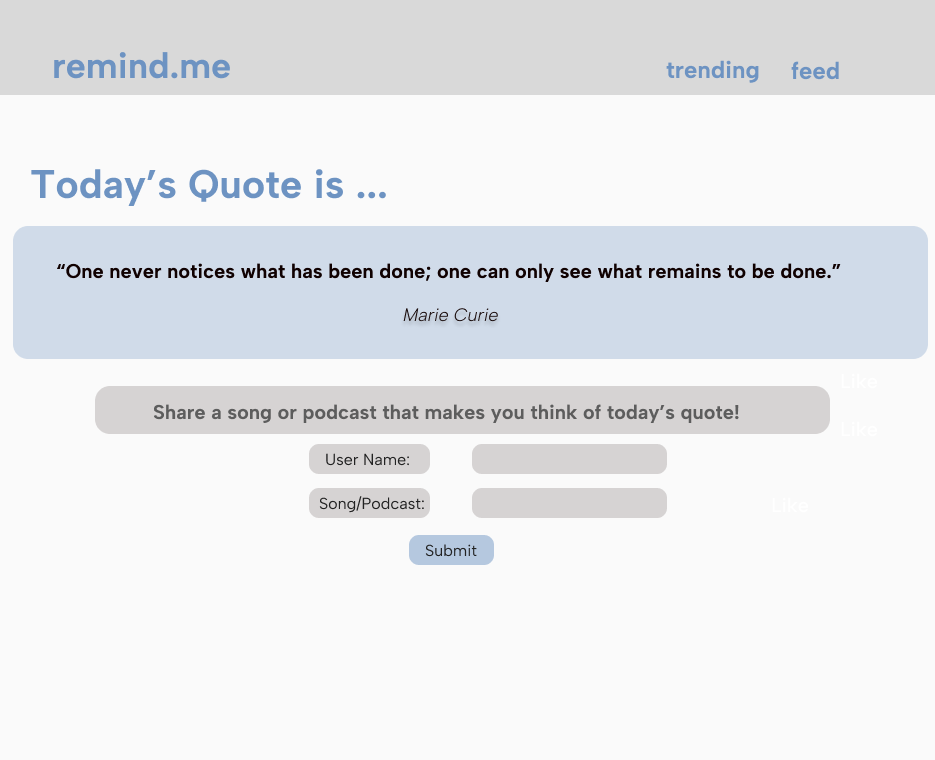
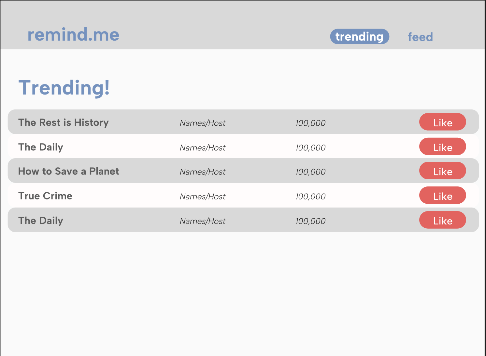

# UI Diagrams 

## Prompt and Upload Screen
The prompt and upload features the quote/theme of the day and an input area for the user's username and the user's submission. The user will submit a song/podcast they feel reminds them/relates to the quote/theme of the day. The user is not able to view or access their feed or the trending section until they make a contribution for the quote/theme of the day. Additionally, the user is only able to make submission each day. 

On this screen, there are three main elements
1. **Daily Quote Display**. The quote/theme of the day is positioned front and center of the screen. If it is a quote, it will credit the person that originated it. 
2. **User Input**. There are two input boxes positioned below the daily quote display, and they prompt the user to input their username and their submission of a related song/podcast. Right below these two boxes is a submit button.
3. **Daily Refresh**.The screen will update daily to display a new, different daily quote/theme and allow users to make a new submission. 

## Feed Screen
The Feed Screen is where the user will be directed to after uploading their submission to the "theme of the day". This screen is designed to allow the user to interact with other the submissions of other individuals. The UI is designed to be organized and aesthetically appealing, allowing users to easily view the submissions and get basic information about them. It also allows them to interact with other users in a simple yet effective manner. 

On this screen, there are four main elements. 
1. **User Feed**. The feed allows users to scroll and see what other user's submitted for the given theme of the day. Each submission will have its own "widget" on the feed. Each widget will display a cover photo, the name of the podcast or article, the hosts and/or authors, and other additional information specific to the media. 
2. **Navigation Bar**. A navigation bar is available at the header of the page to allow the user to switch between looking at their feed and looking at trending submissions.  
3. **Like Button**. Each widget will have a like button at the bottom left, allowing users to "heart" other user's submissions. 
4. **Daily Refresh**. The feed should clear at the start of each day, allowing a new cycle of submissions to pop up specific to the new day's topic. 

## Trending Screen
The Trending Screen is where the user will be directed to after uploading their submission to the "theme of the day". This screen is designed to allow the user to gain insight into the most popular submissions. The UI is designed in a leaderboard fashion so that users can quickly glance at the trending board without being overwhelmed with information. 

On this screen, there are four main elements. 
1. **Trending Chart**. The trending chart allows users to view the most popular media submitted for that day. The top 5 podcasts/news articles will be ranked in order, displaying the title, name/podcast, and the number of submissions. A like button will also be available so that other users can "like" the trending submissions. 
2. **Navigation Bar**. A navigation bar is available at the header of the page to allow the user to switch between looking at their feed and looking at trending submissions.  
3. **Like Button**. Each widget will have a like button at end of its entry, allowing users to "heart" the podcast/news article.
4. **Daily Refresh**. The trending chart should clear at the start of each day, allowing a new cycle of submissions to pop up specific to the new day's topic. 

