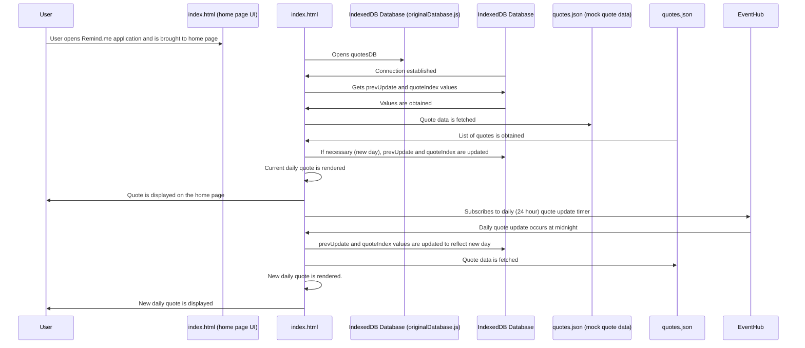

### Feature: Daily Quote Generation and Display

***Description**: The daily quote displayed on the home page of the application is integral to the application as a whole. It defines a new theme daily for which users can then submit a song/podcast. When users open up the application, they are immediately taken to the home page on which the daily quote is generated and displayed. The quote for the day is fetched from quotes.json (the mock data for this implementation of the front-end). To ensure all users, across different devices and sessions observe the same quote on any given day, a quote is selected based on a common index stored in an IndexedDB database. From there, the quote associated with that given index is simply displayed on the home page for the user. In order to ensure that users see the same daily quote and that the quote is not updated prematurely, the time of the previous update is also stored in the database. As for the daily quote generation functionality, at midnight, the quote is changed/updated to a new daily quote. Utilizing the EventHub, a 24 hour timer is used to accordingly update the new daily quote and the values associated with it (the index and previous update).

