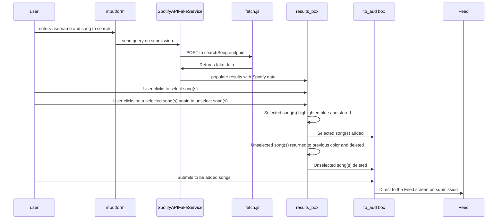

# Song/Podcast Search Feature

## Collaboration Acknowledgment
I collaborated with Mai Chi Le on this feature. I implemented 
the foundational/backend components and she built on the backend.

## Description
This feature allows users to search for songs using a username and song query.
When the user submits their input, it is sent to a fake Spotify API service via
a POST request handled by fetch.js. The fake service returns mock data resembling
Spotify results, which are then displayed in a results box. Users can interact with
the results by selecting one or more songs directly from the displayed list. 
Clicking on a song saves them in a local variable. When the submit button is pressed,
the page redirects to the Feed page.

For Milestone 4, submitting the form will perform a POST request to the backend to
store the saved songs in a database entry associated with the user and the current
quote.
