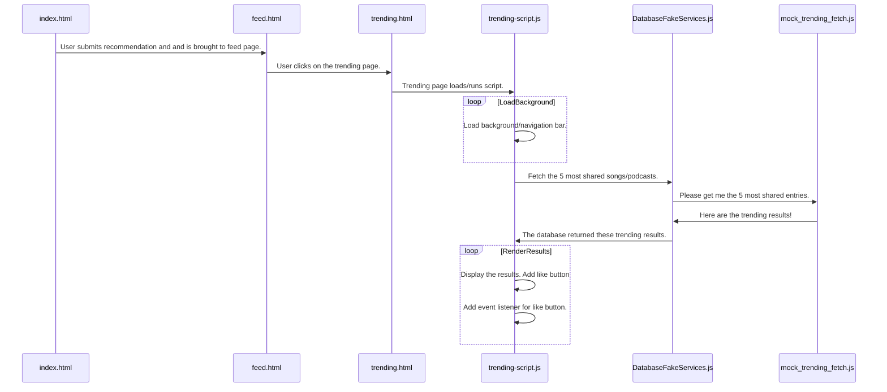

```mermaid
sequenceDiagram

  index.html->>feed.html: User submits recommendation and and is brought to feed page.
  feed.html->>trending.html: User clicks on the trending page.
  trending.html->>trending-script.js: Trending page loads/runs script. 
  loop LoadBackground
    trending-script.js->>trending-script.js: Load background/navigation bar.
  end
  trending-script.js->>DatabaseFakeServices.js: Fetch the 5 most shared songs/podcasts.
  DatabaseFakeServices.js->>mock_trending_fetch.js: Please get me the 5 most shared entries. 
  mock_trending_fetch.js->>DatabaseFakeServices.js: Here are the trending results!
  DatabaseFakeServices.js->>trending-script.js: The database returned these trending results. 
  loop RenderResults
    trending-script.js->>trending-script.js: Display the results. Add like button
    trending-script.js->>trending-script.js: Add event listener for like button. 
  end

```
