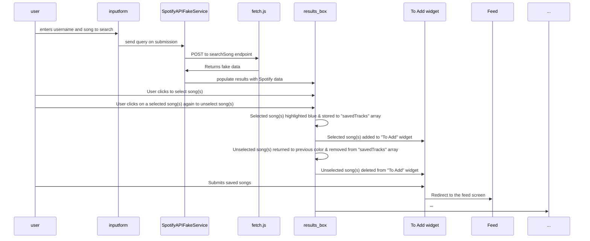

### Feature: Song/Podcast Search Feature

## Collaboration Acknowledgment
I collaborated with Elijah Sippel on this feature, utilizing his backend implementation, I used it to save Spotify songs that users wish to add. Building upon this framework, I extended the functionality by implementing an intuitive and user-friendly interface. 

To enable users to dynamically add or remove songs to/from their "To Add" list/box I developed the logic and UI. When a user selects a song from the Results box, it is highlighted for clarity; when the song is unselected, the highlight is deleted. I also implemented a "To Add" box/widget feature to ensure selected songs are displayed in the "To Add" box and are dynamically removed upon unselection.

I added a submit button under the "To Add" box title that verifies users have added at least one song before proceeding. I also included logic that, after a user submits, takes them to the feed screen, where they can view other people's submitted songs.

By guaranteeing that the chosen songs are properly tracked and submitted for additional processing, the feature also establishes the foundation for Milestone 4.

## Description
This feature allows users to search for songs using a username and song query.
When the user submits their input, it is sent to a fake Spotify API service via
a POST request handled by fetch.js. The fake service returns mock data resembling
Spotify results, which are then displayed in a results box. Users can interact with
the results by selecting one or more songs directly from the displayed list. 
Clicking on a song saves them in a local variable, highlights them, and adds them 
to a To Add box to be viewed in real-time. Clicking on the saved song again deletes 
them from the local variable, deletes the highlight, and deletes them from the 
To Add box in real-time as well. When the submit button is pressed, the page 
redirects to the saved song feed page with other user's submitted songs.

For Milestone 4, submitting the form will perform a POST request to the backend to
store the saved songs in a database entry associated with the user and the current
quote.
