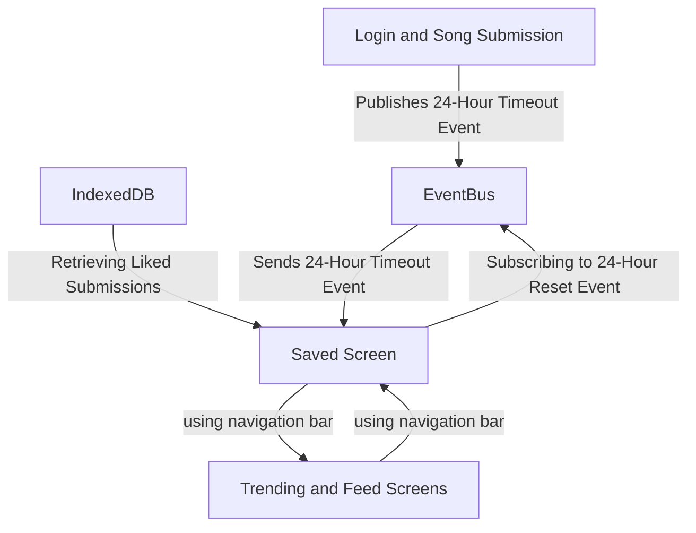

This diagram illustrates the "Saved" screen feature and its role within the application. The "Saved" screen displays songs that users have liked from the "Trending" and "Feed" pages. These liked songs are stored in an IndexedDB instance, and the "Saved" screen dynamically updates by retrieving the latest data from the database whenever a new song is liked. Users can navigate between the "Saved" screen and other screens using a navigation bar. Additionally, the "Saved" screen resets every 24 hours by subscribing to a shared Reset event.

