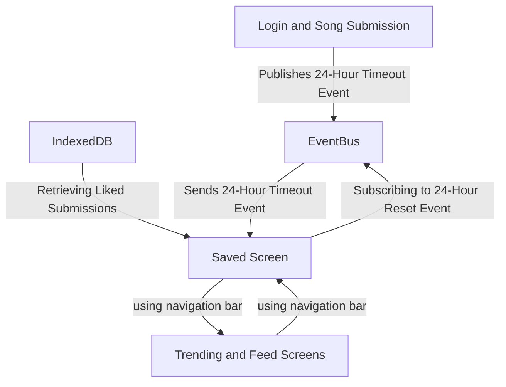

```mermaid
graph TD;
    A[Login and Song Submission];
    B[Saved Screen]--using navigation bar-->C[Trending and Feed Screens];
    C--using navigation bar-->B;
    D[IndexedDB]--Retrieving Liked Submissions-->B
    B-- Subscribing to 24-Hour Reset Event-->E[EventBus]; 
    A--Publishes 24-Hour Timeout Event-->E; 
    E--Sends 24-Hour Timeout Event -->B;
```
