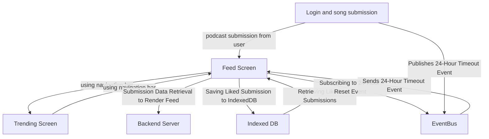

### Feature: Feed Screen

***Description**: The feed screen is a central feature of the application, allowing users to interact with submissions given for the daily prompt from other users. Submissions stored in a remote database is pulled and displayed on the feed screen in a dynamic grid layout. Each submission appears as an individual "widget" on the feed screen. Each widget features the cover photo of the podcast, alongside the name and hosts of the podcast. Each widget also features a small save button that the user can click to save or "like" a submission. This button is used to save the chosen submission to IndexedDB, which is referenced to compile a list of the user's saved songs on the "Saved" page. At midnight, the feed screen resets, clearing out past submissions and is ready to display future submissions. 

